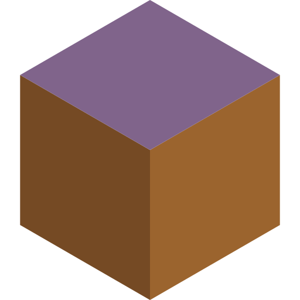
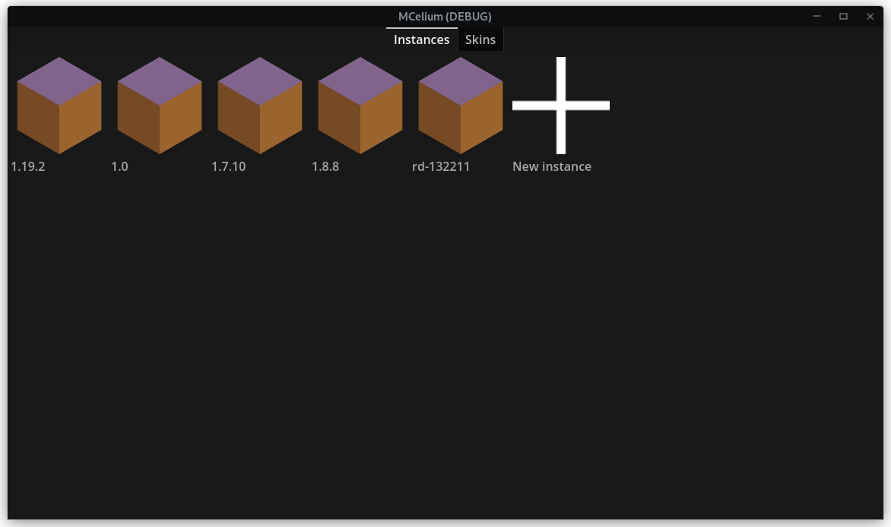

# MCelium
Cross-platform gamepad friendly launcher for Minecraft Java and Bedrock Edition.

## Feature Progress
### Java Edition
- [x] Microsoft login  
- [ ] Mojang login  
- [x] Downloading Java Edition  
- [x] Automatically downloading a compatible Java version from Adoptium
- [x] Launching Java Edition  
	Modern versions launch perfectly.  
	Legacy versions ~1.7-1.8 don't launch.  
- [ ] Uploading skins
- [ ] Switching skins
#### Modding
- [x] Installing Fabric loader  
- [ ] Installing Forge
- [x] Installing mods from Modrinth  
	- [x] Downloading dependencies
	- [ ] Managing multiple dependency versions  
	- [ ] Updating mods
- [x] Installing modpacks from Modrinth  
- [ ] Installing resourcepacks from Modrinth  

## Bedrock Edition
- [ ] Downloading Bedrock Edition
- [ ] Launching Bedrock Edition
- [ ] Java Edition crossplay using Geyser

# References
* [Inside a Minecraft Launcher](https://ryanccn.dev/posts/inside-a-minecraft-launcher/)
* [Modrinth Docs](https://docs.modrinth.com/api-spec/)
* [Fabric Metadata API](https://github.com/FabricMC/fabric-meta#fabric-meta)